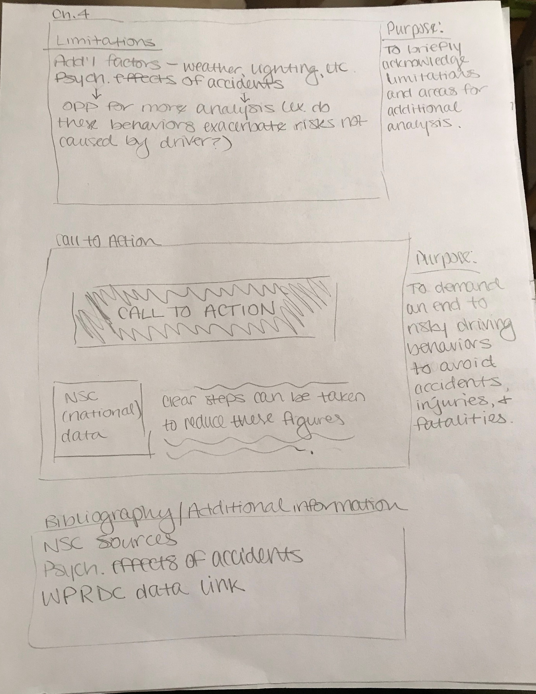

# Outline
High-level summary: Through my final project, I am interested in exploring the effect of driver behaviors on the occurrence and outcomes of car accidents in Allegheny County in 2018 to demonstrate how changes in these behaviors could reduce crashes and the resulting fatalities and injuries.

A total of 12,418 reportable car crashes occurred in Allegheny County during 2018. When reporting these incidents, police records include, among other information, the location of the crash, any fatalities or injuries, and the factors associated with the crash. With a total of 68 deaths and over 6,800 injuries caused by these crashes, I became interested in looking at the factors involved to identify the extent to which behaviors within driver control like speeding, driving under the influence, and failing to wear a seatbelt are associated with the prevalence of accidents and the injuries and deaths that result. [NOTE: All but one of the factors have a direct relationship to the occurrence of the accident. The excluded factor, failing to wear a seatbelt, is more associated with outcomes (injuries or fatalities) than the occurrence of an accident. As a result, any time I am examining factors that are affiliated with the occurrence of an accident, I will use only the appropriate factors. When talking about the outcomes, I will consider both the factors that could influence the accident behind these outcomes as well as the failure to wear a seatbelt.]

My user stories:
As a reader, I want to understand how driver behaviors impact the prevalence and severity of car accidents in Allegheny County.
As a designer, I want to convey to readers that thousands of auto accidents, and resulting injuries and fatalities, are the product of dangerous driver behaviors, and therefore could possibly be avoided by refraining from these behaviors.

I plan to begin my final project with an introduction like that above to establish the scope of the issue and the angle from which I am investigating it. I will include call-out visualizations to highlight major statistics on car accidents, injuries, and fatalities. I will then break the story into several chapters.

The first “chapter” will provide an overview of the relationship between risk behaviors and car accident outcomes at a broad level. The first visualization in this section will summarize the overall trend in the number of car accidents from 2008-2018 in Allegheny County. Additionally, I will illustrate the number of accidents in 2018 that were related to one or more risk behaviors to summarize the role of these behaviors at a high level. Finally, I will break down the prevalence of each of these factors in the accidents that occurred, as multiple factors may have been involved with one accident.

The second chapter will further explore the damage caused by mutable behavioral factors by linking these behaviors to fatalities and injuries resulting from these accidents, rather than just the prevalence of these accidents themselves. The visualizations will illustrate the total number of fatalities tied to at least one of these behavioral factors. It will also do the same for the total number of injuries.

The third chapter will further explore this concept using a single visualization that traces the outcome of each accident. I plan to do this by creating an alluvial diagram that demonstrates how accidents are distributed first between those involving one or more of these factors and those that did not, secondly among which risk factor was involved, and finally among the most severe outcome experienced by at least one person involved in the accident.

The fourth chapter will briefly acknowledge the limitations of my work to demonstrate that further analysis could provide more insight on these trends. For example, the original dataset records weather, lighting, and other conditions that could be analyzed alongside data on driver behaviors to determine which of these behaviors appear to increase the likelihood of an accident in suboptimal conditions.

Finally, I plan to conclude with a call to action that demands an end to these dangerous behaviors in order to avoid preventable crashes, injuries, and deaths. To emphasize this point, I will include [National Safety Council data](https://www.nsc.org/road-safety/safety-topics/fatality-estimates) on the 40,000 fatalities and 4,500,000 serious injuries that occurred nationally in 2018. There are clear steps that Americans can take to reduce auto accident fatalities and injuries.

# Sketches
NOTE: The graphs drawn in are placeholders. Aside from a few instances, like with the alluvial graph, I haven’t played around with what visualizations would best show the data. Similarly, I haven’t decided which Shorthand layouts would be appropriate for each section.

# Data
I located the data that I am using for this project using the Western Pennsylvania Regional Data Center. The dataset I am working with, “Allegheny County Crash Data,” was uploaded by PennDOT and is updated annually. I will use the most recent year available (2018). The dataset includes over 160 fields recording factors and outcomes related to each reportable accident. (“Reportable accident” refers to an incident on a road open to the public that involved at least one motor vehicle in transport and resulted in at least one of the following outcomes: injury to any person; death of any person; or damage to any vehicle to the extent that it cannot be driven under its own power in its customary manner without further damage or hazard to the vehicle, other traffic elements, or the roadway, and therefore requires towing.)

So far, I have cleaned the data and narrowed its scope to the fields most of interest to me. This included translating various "Yes"/"No" columns into indicator columns, combining information from several columns to create an aggregate indicator, and creating aggregate columns and rows to identify totals for categories like fatalities and injuries, total number of factors involved, etc. I have also started sorting the data I will need for each visualization into separate tabs to help keep the number of fields manageable for each component. I anticipate additional work with the data will be necessary as I perform further analysis and develop the visualizations.

# Method & Medium
Now that I have organized the data, I plan to start experimenting with the visualizations I can make based on my initial thoughts in the sketches and the advice provided in class and the textbook. To construct the visualizations for the data story, I plan to use Tableau primarily, as well as RAWGraphs to construct the alluvial diagram I plan to include.

After constructing these visualizations, I plan to present the final product using Shorthand. I plan to build a visual story that separates each section into a “chapter” and incorporates text and data visualization seamlessly. I want to take more time to experiment with the different set-ups (scrolling text with visualizations, scrolling through different visualizations within a single “chapter,” etc.) to think more about what would be best for the project.

I think Shorthand will be an effective method of accomplishing this based on the examples we reviewed in class and through my (preliminary) experimentation with the site because it provides a clean, effective method for moving through the story arc that balances text and visuals.

