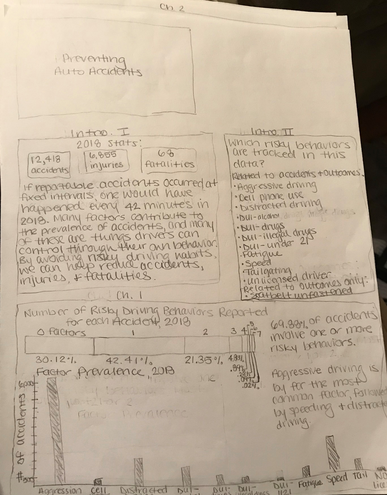
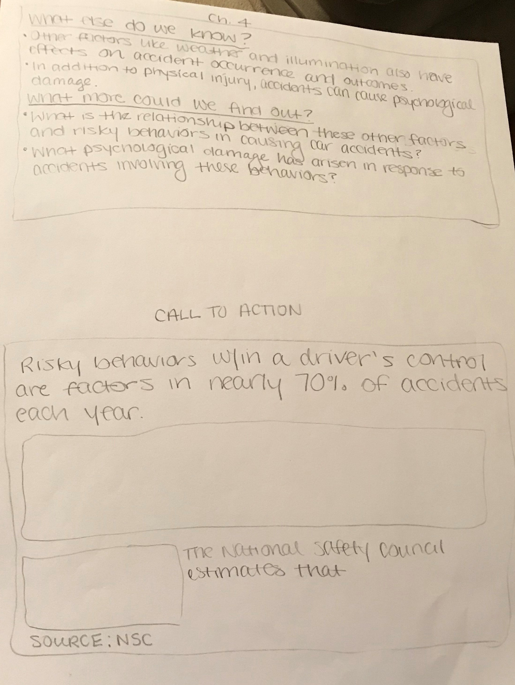

### First Storyboard 

After talking with the course TA, I decided that the best option for my user feedback was to focus on getting feedback on my narrative to determine if it was coherent and relevant. I also wanted to know what they thought about my planned visualizations, but I was more concerned about making sure that the narrative made sense. (I started the project with so much data and had to pare down what I could use effectively for the purposes of this project, and I was worried that this left my points unclear.) As a result, my storyboard focused on the text that I planned to include, with visualizations sketched in approximation to demonstrate the insights that the actual graphics would show.

NOTE: When interviewees reached Ch. 3, I showed them an alluival diagram on a computer.

