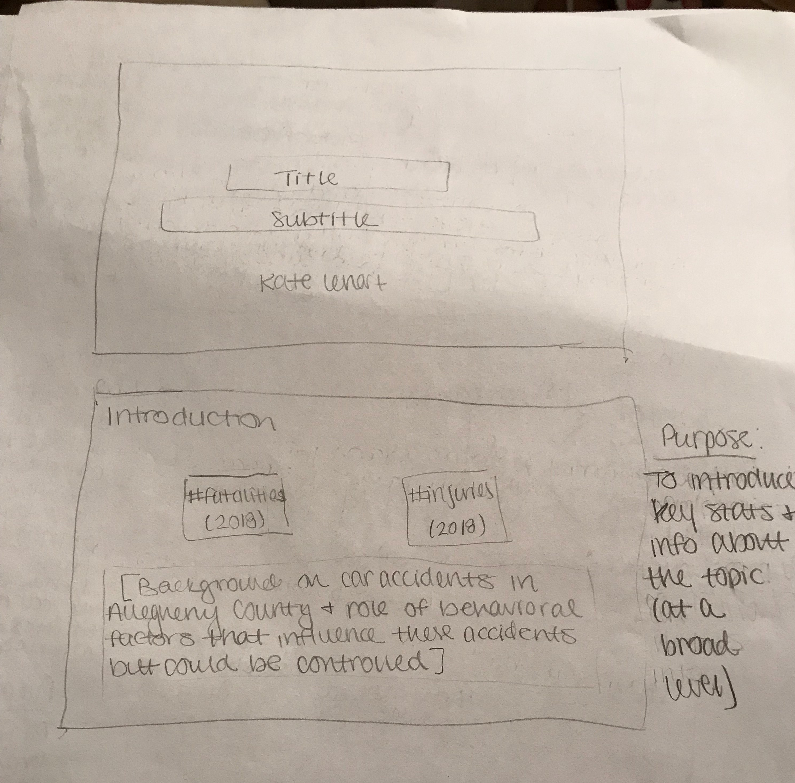
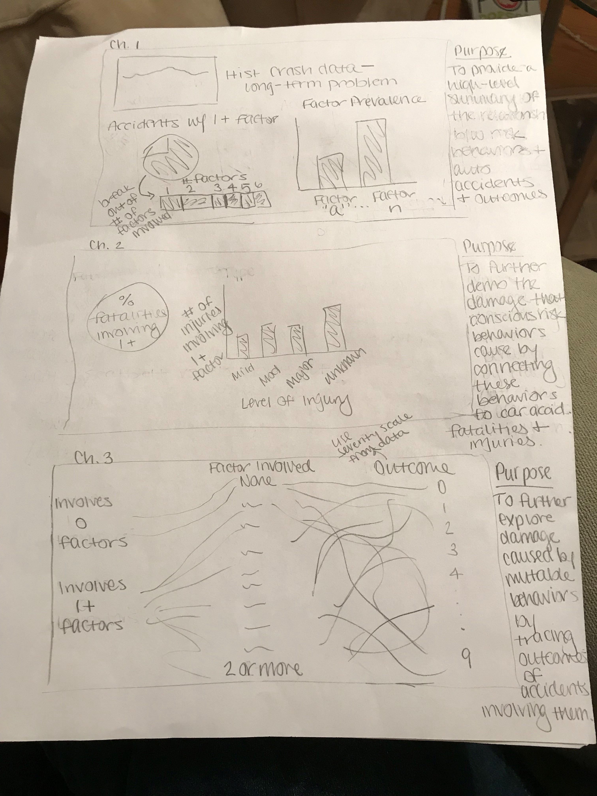
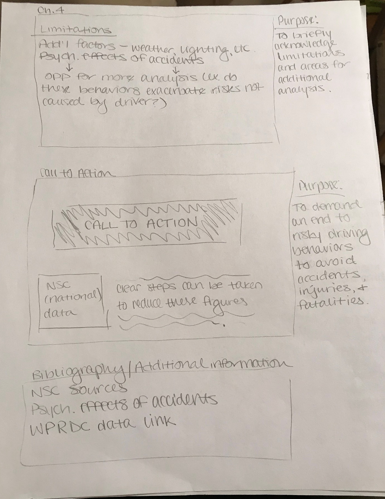

# Part I

## High Level Summary
Through my final project, I am interested in exploring the effect of driver behaviors on the occurrence and outcomes of car accidents in Allegheny County in 2018 to demonstrate how changes in these behaviors could reduce crashes and the resulting fatalities and injuries.

A total of 12,418 reportable car crashes occurred in Allegheny County during 2018. When reporting these incidents, police records include, among other information, the location of the crash, any fatalities or injuries, and the factors associated with the crash. With a total of 68 deaths and over 6,800 injuries caused by these crashes, I became interested in looking at the factors involved to identify the extent to which behaviors within driver control like speeding, driving under the influence, and failing to wear a seatbelt are associated with the prevalence of accidents and the injuries and deaths that result. [NOTE: All but one of the factors have a direct relationship to the occurrence of the accident. The excluded factor, failing to wear a seatbelt, is more associated with outcomes (injuries or fatalities) than the occurrence of an accident. As a result, any time I am examining factors that are affiliated with the occurrence of an accident, I will use only the appropriate factors. When talking about the outcomes, I will consider both the factors that could influence the accident behind these outcomes as well as the failure to wear a seatbelt.]

## My user stories:
As a reader, I want to understand how driver behaviors impact the prevalence and severity of car accidents in Allegheny County.
As a designer, I want to convey to readers that thousands of auto accidents, and resulting injuries and fatalities, are the product of dangerous driver behaviors, and therefore could possibly be avoided by refraining from these behaviors.

## Outline
I plan to begin my final project with an introduction like that above to establish the scope of the issue and the angle from which I am investigating it. I will include call-out visualizations to highlight major statistics on car accidents, injuries, and fatalities. I will then break the story into several chapters.

The first “chapter” will provide an overview of the relationship between risk behaviors and car accident outcomes at a broad level. The first visualization in this section will summarize the overall trend in the number of car accidents from 2008-2018 in Allegheny County. Additionally, I will illustrate the number of accidents in 2018 that were related to one or more risk behaviors to summarize the role of these behaviors at a high level. Finally, I will break down the prevalence of each of these factors in the accidents that occurred, as multiple factors may have been involved with one accident.

The second chapter will further explore the damage caused by mutable behavioral factors by linking these behaviors to fatalities and injuries resulting from these accidents, rather than just the prevalence of these accidents themselves. The visualizations will illustrate the total number of fatalities tied to at least one of these behavioral factors. It will also do the same for the total number of injuries.

The third chapter will further explore this concept using a single visualization that traces the outcome of each accident. I plan to do this by creating an alluvial diagram that demonstrates how accidents are distributed first between those involving one or more of these factors and those that did not, secondly among which risk factor was involved, and finally among the most severe outcome experienced by at least one person involved in the accident.

The fourth chapter will briefly acknowledge the limitations of my work to demonstrate that further analysis could provide more insight on these trends. For example, the original dataset records weather, lighting, and other conditions that could be analyzed alongside data on driver behaviors to determine which of these behaviors appear to increase the likelihood of an accident in suboptimal conditions.

Finally, I plan to conclude with a call to action that demands an end to these dangerous behaviors in order to avoid preventable crashes, injuries, and deaths. To emphasize this point, I will include [National Safety Council data](https://www.nsc.org/road-safety/safety-topics/fatality-estimates) on the 40,000 fatalities and 4,500,000 serious injuries that occurred nationally in 2018. There are clear steps that Americans can take to reduce auto accident fatalities and injuries.

## Sketches
NOTE: The graphs drawn in are placeholders. Aside from a few instances, like with the alluvial graph, I haven’t played around with what visualizations would best show the data. Similarly, I haven’t decided which Shorthand layouts would be appropriate for each section.

## Data
I located the data that I am using for this project using the Western Pennsylvania Regional Data Center. The dataset I am working with, “Allegheny County Crash Data,” was uploaded by PennDOT and is updated annually. I will use the most recent year available (2018). The dataset includes over 160 fields recording factors and outcomes related to each reportable accident. (“Reportable accident” refers to an incident on a road open to the public that involved at least one motor vehicle in transport and resulted in at least one of the following outcomes: injury to any person; death of any person; or damage to any vehicle to the extent that it cannot be driven under its own power in its customary manner without further damage or hazard to the vehicle, other traffic elements, or the roadway, and therefore requires towing.)

So far, I have cleaned the data and narrowed its scope to the fields most of interest to me. This included translating various "Yes"/"No" columns into indicator columns, combining information from several columns to create an aggregate indicator, and creating aggregate columns and rows to identify totals for categories like fatalities and injuries, total number of factors involved, etc. I have also started sorting the data I will need for each visualization into separate tabs to help keep the number of fields manageable for each component. I anticipate additional work with the data will be necessary as I perform further analysis and develop the visualizations.

## Method & Medium
Now that I have organized the data, I plan to start experimenting with the visualizations I can make based on my initial thoughts in the sketches and the advice provided in class and the textbook. To construct the visualizations for the data story, I plan to use Tableau primarily, as well as RAWGraphs to construct the alluvial diagram I plan to include.

After constructing these visualizations, I plan to present the final product using Shorthand. I plan to build a visual story that separates each section into a “chapter” and incorporates text and data visualization seamlessly. I want to take more time to experiment with the different set-ups (scrolling text with visualizations, scrolling through different visualizations within a single “chapter,” etc.) to think more about what would be best for the project.

I think Shorthand will be an effective method of accomplishing this based on the examples we reviewed in class and through my (preliminary) experimentation with the site because it provides a clean, effective method for moving through the story arc that balances text and visuals.

# Part II

## User Research Protocol

The storyboard for user feedback can be found [here](https://klenartcmu.github.io/klenart_portfolio/FirstStoryboard).

### Target Audience

The target audience I plan to reach with my story is all drivers in Allegheny County.

### Identifying Individuals to Interview

I wanted to interview three Allegheny County drivers to determine the extent to which the story and visualizations conveyed the intended message.

### Interview

**Goals & Questions**

|            **Goals**            |             **Questions**            |
|---------------------------------|--------------------------------------|
|Evaluate if narrative makes sense|	What message did you get from this story? Do you think that any of the “chapters” obscure this message?|
|Evaluate if the visualizations effectively support this message|Do you think the visualizations were supportive of the narrative you identified in the previous question? Do you think any of them are particularly effective to this end? Do you think any of them detract from this narrative?|
|Evaluate what questions the viewer has after looking through the story|What did this story leave you wondering about?|
|Evaluate personal connection|Did anything in this story connect with you personally?|
|Identify additional information that the viewer would like to share|Are there any additional aspects of the story that you would like to comment on?|

**Background** 

12,417 reportable auto accidents occurred in Allegheny County in 2018. Police reports document several items related to each accident, including characteristics that may have contributed to the incident or affected the outcomes (injuries or fatalities) that resulted. Although factors like weather and illumination affect accident occurrence, other factors encompass risk behaviors like cell phone use, speeding, and driving under the influence, which are under driver control. As a result, one way to reduce accidents and their outcomes is to reduce driver participation in behaviors like these.

**Methods and Metrics** 

•	Five- to ten-minute, in-person interviews with three Pennsylvania drivers of different ages  
•	Notes from these interviews will be analyzed to identify areas improvement to the story and its visualizations

**Script** 

*Introduction*: Thank you for your time today. I’d like to get some feedback from you on a data story about car accidents and driver risk behaviors. I’ll provide you with a storyboard that outlines the basic narrative of the story with the planned visualizations. Many of these visualizations are preliminary sketches of what the final charts and graphs will be. Because of this, I’d ask you to focus on critiquing these visualizations as parts of the narrative, rather than critiquing them as finished graphics.

*Body*: Please review this storyboard and let me know when you’ve read it through.

1.	Narrative 
    a.	 What message did you get from this story? 
    b.	Do you think that any of the “chapters” obscure this message? 
2.	Visualizations 
    a.	Do you think the visualizations were supportive of the narrative you identified in the previous question? 
    b.	Do you think any of them are particularly effective to this end? 
    c.	Do you think any of them detract from this narrative? 
3.	Viewer questions based on story 
    a.	What did this story leave you wondering about? 
4.	Personal connection 
    a.	Did anything in this story connect with you personally? 
5.	Additional information 
    a.	Are there any additional aspects of the story that you would like to comment on? 

*Conclusion*: Thank you again for your time and your feedback.

**Interview Findings** 

I interviewed three local drivers: a 26 year-old female, a 27 year-old female, and a 27 year-old male. I took notes by hand during these interviews, and I have summarized their responses below to highlight some of the areas I plan to address moving forward.

1.	Narrative 
    a.	What message did you get from this story? 
        i.	There are a lot of driver behaviors involved in accidents. 
        ii.	Aggressive or distracted driving can result in accidents. 
        iii.	Being safer while I drive could help avoid accidents. 
    b.	Do you think that any of the “chapters” obscure this message? 
        i.	No 
        ii.	No, but some clarification on the section about the work that could be done might help. It could be framed differently to               demonstrate that it is beyond the scope of this project 
        iii.	No, as long as you add some text to explain the alluvial diagram. 
2.	Visualizations 
    a.	Do you think the visualizations were supportive of the narrative you identified in the previous question? 
        i.	Yes, but I do think the order they were in didn’t necessarily make immediate sense. Maybe that could be clarified. 
        ii.	Yes. The visuals clearly show that there is a correlation between the risk factors and accidents. 
        iii.	Yes, and they cover accident risk and potential outcomes. 
    b.	Do you think any of them are particularly effective to this end? 
        i.	The pie chart – only had to look at it for a split second to understand what it was saying 
        ii.	The pie chart – there are only two categories, so it becomes really clear that vast majority of accidents involve at least               one of the behaviors 
        iii.	The bar graph of risk factors stuck out at me because it shows that aggressive driving is a factor in so many accidents. 
    c.	Do you think any of them detract from this narrative? 
        i.	No. 
        ii.	Don’t know if this is “detracting,” exactly, but the very small portion of the first visual (proportions of accidents                   involving a given number of risk factors) is difficult to read and interpret because some of the percentages are so small.               This made it more difficult to figure out that part of it. 
        iii.	The alluvial diagram is helpful once it’s clear what’s going on. That could use some clarification- labeling and maybe a                 brief explanation of the point, for people who aren’t familiar with that type of graphic. 
3.	Viewer questions based on story 
    a.	What did this story leave you wondering about? 
        i.	The order the graphs – could’ve benefitted from a little more explanation at the start of each section that described what               that chapter’s overall point was to show why the graphs included in that section made that point. Without it, it felt like               the story jumped back and forth from risk factors to fatalities and injuries and back again. 
        ii.	Can’t help but wonder about factors like weather and lighting, even though those were listed as areas of future work. 
        iii.	Precise definitions for some of the terms – would have liked to see some of the behaviors defined that are more                         ambiguous, like “aggressive driving.” 
4.	Personal connection 
    a.	Did anything in this story connect with you personally? 
        i.	“It made me think about some the things I do while I drive, especially using my phone. I know I do it, even though I                     shouldn’t. I noticed a distinction between the risky behaviors that I do while driving, like using my phone, versus those               that I don’t, like being aggressive. It was hard not to check off mentally a few behaviors I know I do as I looked down the list.” 
        ii.	“Working in the legal field, I’ve found it surprising how many DUI cases I’ve seen in progress since I started my career. I             think it’s more common than most people think, and this helps show that this is a problem locally and an unnecessary risk.” 
        iii.	“My mom was is in an accident caused by an unlicensed driver earlier this year. She was ok, but the fact that he was                     unlicensed made things more complicated. It was interesting to see that as a category here, and to think about it as a                   risk factor like cell phone use and driving under the influence.” 
5.	Additional information 
    a.	Are there any additional aspects of the story that you would like to comment on? 
        i.	No. 
        ii.	It might help to clarify the distinction between the two types of variables at the beginning – does “accident outcome” just             refer to injuries and fatalities? 
        iii.	The storyboard was a little cramped at times, but I think creating the final project digitally would correct for that. 

**Changes Resulting from Interviews** 

The updated storyboard I created based on user feedback can be found [here](https://klenartcmu.github.io/klenart_portfolio/SecondStoryboard). 

1.	Clarify terms 
    a.	Include definitions of ambiguous terms, like “aggressive driving” (PennDOT) 
    b.	Clarify that “outcomes” refer to injuries and fatalities 
2.	Clarify the path of the narrative to make the visualizations transition more smoothly. 
    a.	The first set is about the overall landscape of the relationship between risk factors and accidents. The purpose of this                 section is to demonstrate that the vast majority of accidents involve one or more of these risk factors, and that aggression             is by far the most frequent risk factor, followed (at a distance) by speeding and distracted driving. 
    b.	The second set is about tying these risk factors to outcomes (injuries and fatalities). This section demonstrates that                   almost three-quarters of accident fatalities involve one or more of these factors. About three-quarters of injuries with                 known severity result from accidents involving these risk factors. 
    c.	The final graph charts the relationship between accidents, the number of risk factors, and the most severe outcome that                 occurred as a result of that accident. This chart shows that accidents with behavioral risk factors are just as destructive             as those with other factors only. 
3.	To further clarify the path of the narrative, use colors to signal the section of the story. I will also select visualization           colors that will coordinate with the primary color of that section. 
4.	Experiment with another type of visualization for the first graph (proportions of accidents involving each number of factors) or         use an inset to clarify the values for the very small proportions (as with the candidate philanthropy project). Talk to                 Chris/Matt about dealing with this type of issue. (In progress) 
5.  Add text to the alluvial diagram to clarify labels and interpretation. Also, change the text of “0”/“1” for “no                        factors”/“factors” to “no”/“yes.” (In progress, although in looking at my storyboard with fresh eyes, I'm not sure how much this        visualization adds.) 

# Part III
## Intended Audience
My intended audience for the final story is drivers in Allegheny County. I narrowed my focus in part based on the data that I was using, but also because while some behavioral risk factors for accidents could apply nationwide, other circumstances are regionally-specific. To make my final project work for my audience, I had to think about how to accommodate the perspectives of drivers in Western Pennsylvania. In an effort to do this, I acknowledged the additional work that could be done in this area but was beyond the scope of this project. This included weather and illumination, which are certainly factors that can affect driving in this part of the state. 

Additionally, I used a narrow focus for my audience because sometimes, data on a national scale can feel impersonal and distant. By shifting the focus to a specific county, the statistics and factors may have more resonance with the intended audience.

## Design Decisions
A few of the most significant design decisions that I made over the course of the project are linked to the biggest takeaways I have from this process. ... Finally, the

## Final Data Story
You can view my final data story [here](https://carnegiemellon.shorthandstories.com/LenartFinalProject/index.html).
